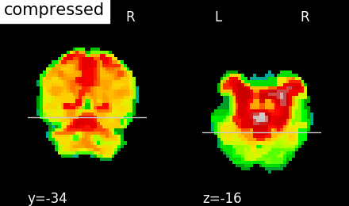
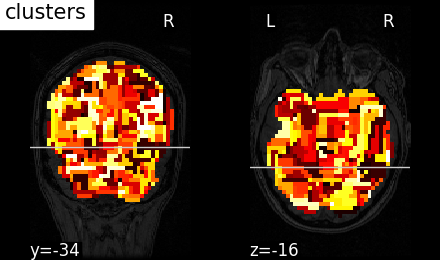

# Recursive nearest agglomeration (ReNA)

ReNA is a fast clustering for approximation of structured signals.


## Dependencies

* Python >= 2.6  
* scikit-learn >=0.15
* nilearn >= 0.2.4 
* nibabel >= 1.1.0 
* numpy >= 1.7.1
* scipy >= 0.15
* matplotlib (examples)


## Running the examples

### Clustering images of faces

Compression of face images from the Olivetti Faces Dataset using 250 clusters.

```python
python example_faces.py
```


----

### Clustering brain images

Compression of a brain image (MRI) from the [Haxby2001](http://www.ncbi.nlm.nih.gov/pubmed/11577229) dataset using 2000 clusters.


```python
python examples_neuroimaging.py
```




